# 🐰 SillyBunny 🐰
<div>

</div>

<div align="center">

English | [Deutsch](.github/readme-de_de.md) | [中文](.github/readme-zh_cn.md) | [繁體中文](.github/readme-zh_tw.md) | [日本語](.github/readme-ja_jp.md) | [Русский](.github/readme-ru_ru.md) | [한국어](.github/readme-ko_kr.md)

</div>

---

An elegant fork of [SillyTavern](https://github.com/SillyTavern/SillyTavern), designed with a cleaner, graphical shell UI; Bun-based backend; built-in tutorials, presets, extensions, and a quick-start dashboard; and a lightweight agentic system to facilitate modern agent functionality.

> [!WARNING]
> This is an in-dev fork, and is considered beta quality. [Please direct SillyBunny-specific issues to this project's issue tracker.](https://github.com/platberlitz/SillyBunny/issues) If an issue is reproducible in upstream SillyTavern, please report it upstream instead.
>
> Disclaimer: LLMs are used to facilitate development of this fork. Overall software design, prompting, testing, and documentation are handled by humans. To keep things simple, we try to maintain close to upstream as possible.

<details>
<summary><h2>Screenshots</h2></summary>

These screenshots show the graphical shell UI across Workspace, Customize, Agents, Characters, Search, and a Bunny Guide in-chat view on desktop and mobile.

#### Desktop

| Desktop Workspace Menu | Desktop Customize Menu |
| :---: | :---: |
| 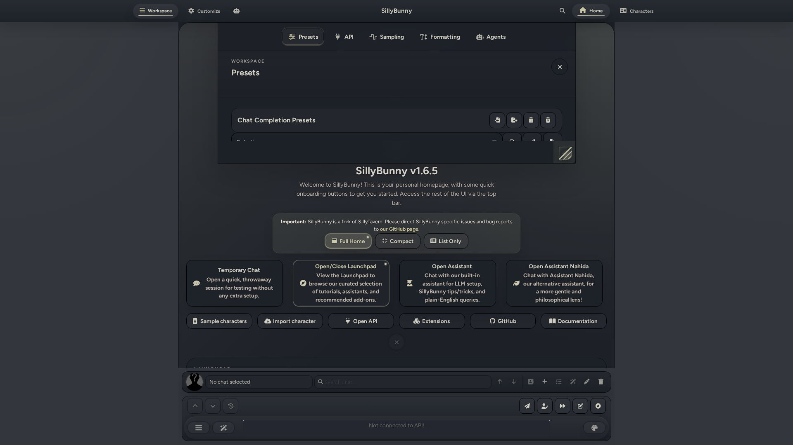 | 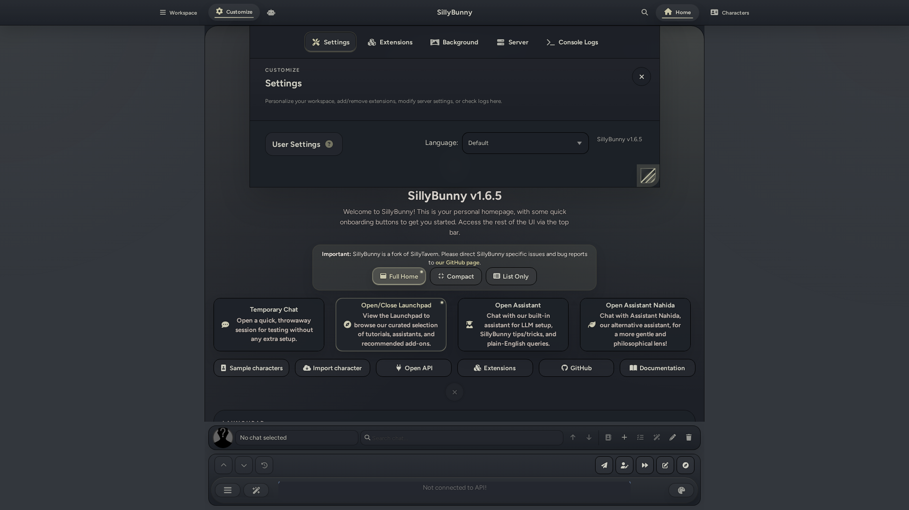 |

| Desktop Agents Menu | Desktop Characters Menu |
| :---: | :---: |
| 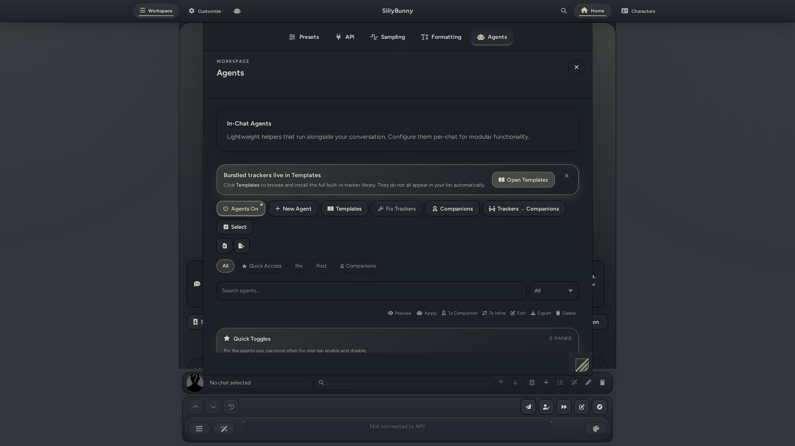 | 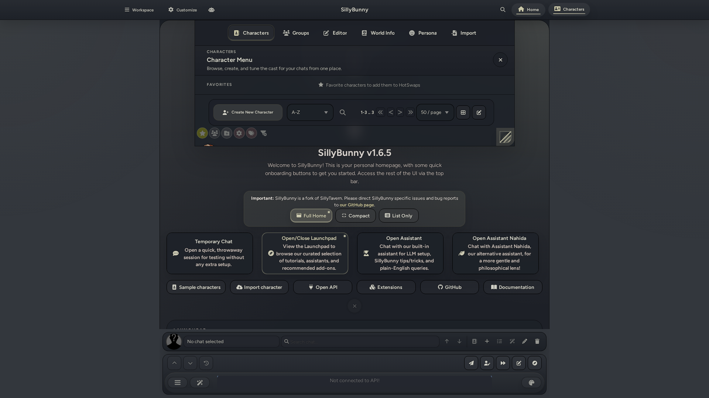 |

| Desktop Search | Desktop Chat |
| :---: | :---: |
| 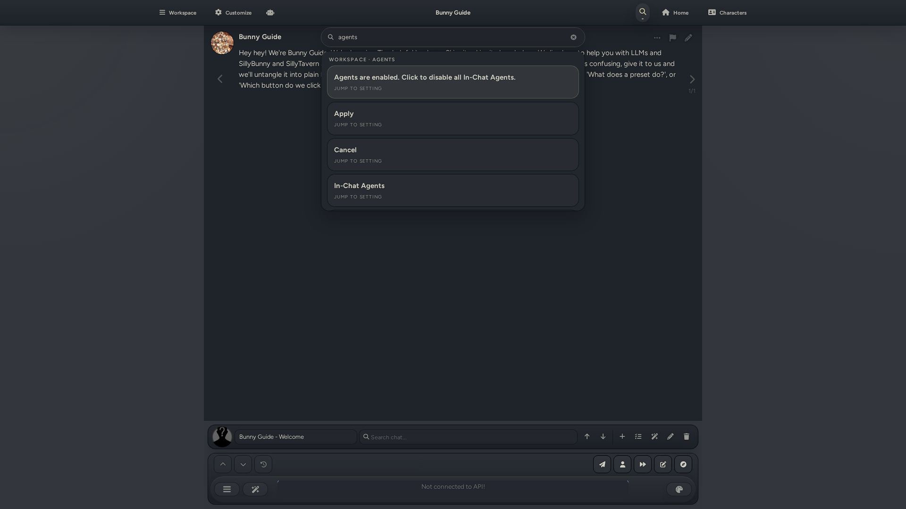 | 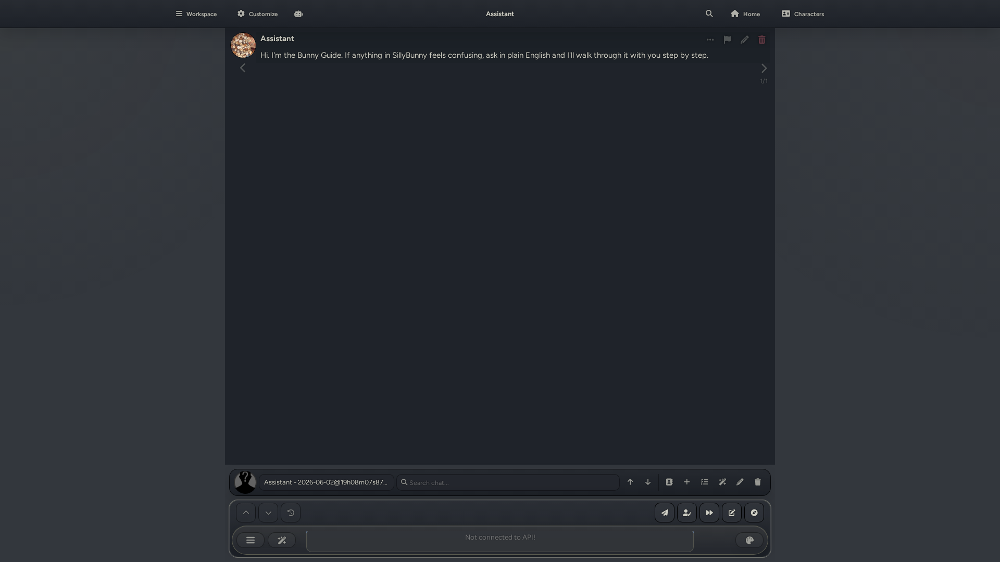 |

#### Mobile

| Mobile Workspace Menu | Mobile Customize Menu | Mobile Agents Menu |
| :---: | :---: | :---: |
| 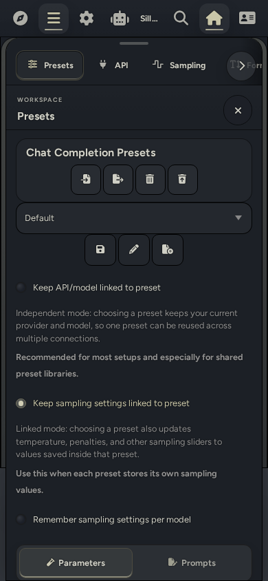 | 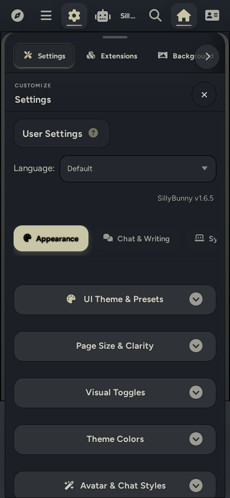 | 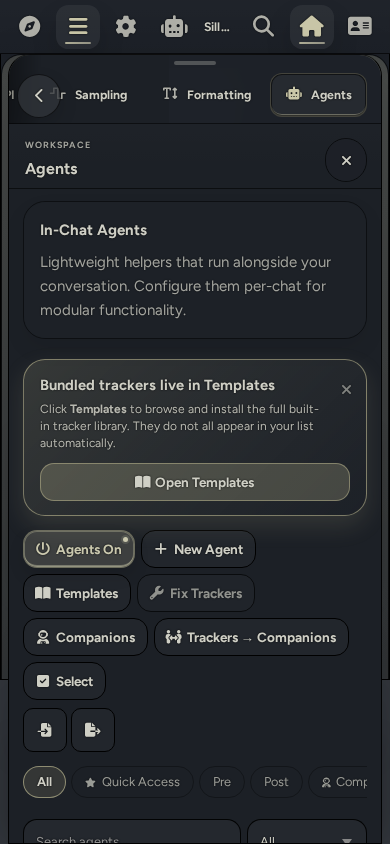 |

| Mobile Characters Menu | Mobile Search | Mobile Chat |
| :---: | :---: | :---: |
| 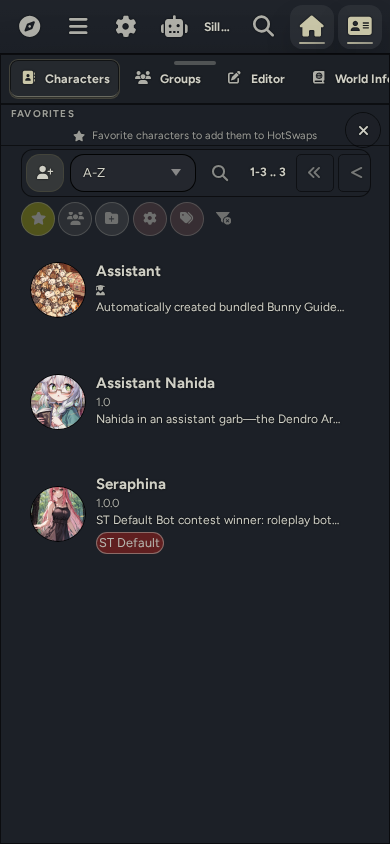 | 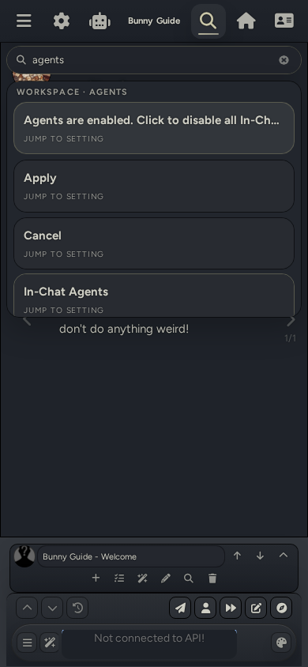 | 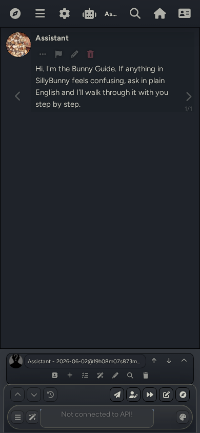 |

</details>

---

## Table of Contents
* [At a Glance](#at-a-glance)
* [Installation](#installation)
    * [macOS Notes](#macos-notes)
    * [Termux (Android) Notes](#termux-android-notes)
    * [Update Instructions](#how-to-update)
* [Project Goals](#project-goals-aka-why-we-made-this-fork)
* [Changes Compared to SillyTavern](#changes-vs-sillytavern)
* [Latest Update](#latest-update)
    * [v1.6.4 (2026-06-10)](#v164-2026-06-10)
* [Upstream Information](#upstream-information)
* [Contributors](#contributors)
***

## At a glance

| | |
|-|-|
| **UI** | Custom navigation shell with search, themes, and mobile layout |
| **Runtime** | Bun (auto-installed), Node.js fallback |
| **Bundled Goodies** | Pre-bundled RP presets, complementary extensions, and additional themes, alongside built-in detailed tutorials |
| **Agents** | Built-in In-Chat Agents for modular RP prompting |
| **Data** | Drop-in compatible with SillyTavern settings, characters, chats, presets, and extensions |
| **Default port** | `4444` |

---

## Installation

[Grab the latest release here.](https://github.com/platberlitz/SillyBunny/releases/latest)

Or run:

```bash
git clone https://github.com/platberlitz/SillyBunny.git
cd SillyBunny
```

Then, run the appropriate launcher for your OS, which auto-installs all dependencies, checks for updates, and starts a server instance. You can also open `http://127.0.0.1:4444` manually in your browser. The default launchers choose the recommended runtime automatically; use a runtime-specific launcher if you want to force Node.js or Bun.

| Platform | Default / auto | Force Node.js | Force Bun |
|----------|----------------|---------------|-----------|
| Windows | `.\Start.bat` | `.\Start-Node.bat` | `.\Start-Bun.bat` |
| macOS (Terminal) | `./Start.command` | `./Start-Node.command` | `./Start-Bun.command` |
| macOS (Finder) | Double-click `Start.command` | Double-click `Start-Node.command` | Double-click `Start-Bun.command` |
| Linux / WSL | `./start.sh` | `./start-node.sh` | `./start-bun.sh` |
| Android (Termux) | `bash start.sh` | `bash start-termux-node.sh` | `bash start-termux-bun.sh` |
| Docker | `docker compose --project-directory . -f docker/docker-compose.yml up --build` | N/A | N/A |

If you already manage your own Bun install, run via `bun run start`. Other launch variants:

```bash
bun run start:mobile   # lower-memory (--smol)
bun run start:global   # SillyBunny-owned data paths
bun run start:no-csrf  # disable CSRF (local dev)
```

### macOS notes

- If the launcher window closes too fast, run `./Start.command` from Terminal to keep output visible
- Finder launch: double-click a `Start*.command` file (right-click > Open if Gatekeeper warns)
- If Git is missing, the launcher triggers `xcode-select --install` automatically
- Quarantine metadata from ZIP downloads: `xattr -dr com.apple.quarantine /path/to/SillyBunny`
- Stripped permissions from unzip: `chmod +x Start*.command start*.sh scripts/*.sh`

### Termux (Android) notes

```bash
pkg update && pkg upgrade -y
pkg install -y git curl unzip
git clone https://github.com/platberlitz/SillyBunny.git
cd SillyBunny
bash start-termux-node.sh
```

- `bash start.sh` also defaults to Node.js + npm on native Termux and ARM devices when Node.js is available
- To force Node.js explicitly: `bash start-termux-node.sh`
- To force Bun explicitly: `bash start-termux-bun.sh` (this bootstraps `bun-termux` automatically on first run)
- Keep the repo inside Termux home (for example `~/SillyBunny`), not `~/storage/shared` or `/storage/emulated/0`; Android shared storage blocks the `node_modules` links Bun and npm need
- Run `termux-setup-storage` once only to grant SillyBunny access to shared files; do not clone the repo into shared storage
  
### How to Update

Built-in and launcher updates require a Git checkout. ZIP/release folders do not self-update; download and extract the latest release ZIP instead.

| What you want | Command |
|---------------|---------|
| Update from the running app | Open Customize > Server and use the built-in updater |
| Normal launch (auto-checks for updates) | `./start.sh` |
| Force update then launch | `./start.sh --self-update` |
| Update only, don't start | `./start.sh --self-update-only` |
| Skip update check once | `./start.sh --skip-self-update` |
| Disable auto-update permanently | `SILLYBUNNY_AUTO_UPDATE=0 ./start.sh` |

---

## Project Goals (AKA, why we made this fork)

Our primary goals for SillyBunny are as follows:

1) **Simple by default; powerful when needed.** Directly inspired by KDE Plasma's main driving philosophy, SillyBunny is aimed to be simple to understand and intuitive to use by default, with most of the complex settings hidden away from the default workspace. Sane defaults are implemented while all the extra complexity is hidden behind UI elements: still there, but less obtrusive. Our graphical shell best embodies this philosophy.
2) **A focus on roleplay and storytelling.** SillyBunny has a more opinionated purpose compared to upstream SillyTavern. Our goals align closely with the creative writing scene for models, and the general direction of the fork is aimed for that use case. We facilitate this with pre-bundled tutorials/add-ons/presets designed to get you started with LLM creative writing in fun ways.
3) **Modernised features.** We aim to implement new features that can greatly take advantage of modern models and their strong, agentic capabilities. Currently, this includes full support for In-Chat pre and post gen agents that complement the main generation. Models work best on smaller individual tasks, and this is best shown through in-chat agents and their capabilities. We're also looking into features like an RPG game mode that can take advantage of these agents.
4) **Better performance.** Base SillyTavern relies on node.js for its runtime environment. While robust, this is not ideal for performance. We've switched to a Bun runtime to increase general performance and startup times, while optimising for lower power devices like smartphones.
5) **Compatibility**. We remain as closely backwards compatible with upstream SillyTavern as possible. This facilitates easy synchronizing with upstream. We aim to not remove any pre-existing features, unless replacing with a direct alternative. The backend is already very solid, so primary work is done in the frontend space. In addition, we aim to make all our new features compatible with models of all sizes, not just the frontier, SOTA ones. Simplicity is key.

---

## Changes vs. SillyTavern

### Different UI

The original SillyTavern layout is replaced with a custom, easy-to-navigate graphical shell:

- **Top bar**: Reworked with cleaner, better-defined nested menus. Includes Workspace, Customize, Home, and Characters.
- **Bottom bar**: New bottom bar designed for quick access to persona switching, quick chat switching, and add/edit/remove existing chat functionality.
- **Panel-oriented navigation**: Easy access to all settings in nested panels. Collapsible settings sections in both Chat Completions and Text Completions presets.
- **Global search**: A global search bar that queries across presets, lore, extensions, personas, and settings at once.
- **Platform-aware**: Designed for both desktop and mobile, with a dedicated phone/tablet navigation layer.
- **Three modern shell themes**: Modern Glass, Clean Minimal, Bold Stylized.
- **Palette customization**: Easily change the accent colour of any theme you're currently using.

### Bun-first runtime

We primarily use Bun as a runtime, instead of node.js. This results in consistently faster startups, overall performance, and automatic launcher bootstrapping. Node.js is still fully functional as a legacy fallback system.

### In-Chat Agentic Support

SillyBunny has support for In-Chat Agents. These are custom prompt fields that can run separately from the main generation, which allows for a lot of extra flexibility. Included are several pre-built prompts designed for trackers, post-gen cleanup, anti-slop, and more. Agents can use the main model or a different connection profile, allowing for a fast, smaller model to run long agentic tasks with ease while a large, main model writes the actual story content. These are designed to fill the gap between full extensions and simple, modular agentic functionality.

**Pipeline:**

1. **Pre-generation agents** inject prompt text before the main reply is generated, or run as interceptors that rewrite the assembled outgoing context before it reaches the main model.
2. **Main Model** writes the main RP reply.
3. **Post-generation agents** optionally rewrites the contents of the main response, or appends extra content after the reply.
4. **Post-process utilities** can extract structured data, run regex cleanup/formatting, or preserve machine-readable blocks while showing cleaner UI.
5. **Groups and templates** let you swap whole stacks quickly without editing your base preset every time.

**Typical Usecases:**

- Trackers for scene, time, items, relationships, off-screen activity, and world state.
- Writing cleanup passes like anti-slop or regex-based formatting.
- Formatting helpers like direction menus, CYOA choices, or NPC profile cards.
- Randomisers and directives that change the pressure, genre, pacing, or escalation of a scene.
- Content toggles for prose style, difficulty, POV, and HTML artifacts.
- Agentic lorebook navigation for on-demand retrieval, memory maintenance, and tree building.
- Cheap helper-model passes that prepare or polish content without spending your main model's budget.

**Included Agents**

* **Trackers:** Achievements, CYOA Choices, Direction Menu, Event, Item, NPC Profiles, Parallel Off-Screen, Relationship, Reputation, Scene, Secrets, Status, Time, and World Detail.
* **Randomizers:** Chaos Mode, Combined Director's Cut, Dead Dove Escalation, Genre, Grounded Complication, Intimacy & Kink, Scene Driving Force, and Scene Pressure Cocktail.
* **Content:** Difficulty Increase, Don't Write for User, Friction Mode, Grounded Prose, HTML Toggle, and Write for User.
* **Post Generation Editors:** Prose Polisher
* **Additional Agents:** Pathfinder (an agentic lorebook navigator with 8 tools for retrieval, memory maintenance, and tree building).

**Agent Behaviors and Settings**
* Agentic prompts feature inline run-order editing, click-to-edit functionality, and fullscreen prompt editors.
* Agents use the main connection profile by default with an 8192 max token limit. Separate connection profile support is available when explicitly selected.
* Pre-generation interceptors can replace the outgoing context, wrap or append helper output, or add tagged patches. Multiple interceptors run in agent order.
* Bundled trackers, including CYOA Choices, are configured for pre-generation. The main model emits clickable options directly in the response.
* All bundled tracker and menu agents default to the User injection role to maintain compatibility with models that deprioritize System injections.
* Built-in groups are available for the full preset, trackers only, and randomizers only.
* Custom agents support ST-style regex options.

### Bundled Goodies & Tutorials
SillyBunny includes some extras by default to help you get started right away:
* A tutorial that guides you through the SillyBunny interface.
* Pre-bundled roleplay presets from purachina and Geechan, including Pura's Director Preset V13.3, Geechan's Universal Roleplay V5.2, and Geechan's Universal Online Chat V1.0.
* Pre-bundled workflow extensions including Guided Generations, Input History, Quick Image Gen, and Prompt Inspector.
* A character card conversion preset from TLD to help you generate character cards from scratch, or convert from existing cards to a better format.
* A friendly quick-start guide with bundled workflow helpers plus optional recommended extensions such as Summary Sharder, Dialogue Colours, and CSS Snippets.
* Two custom assistants to help you get started - Bunny Guide, and Assistant Nahida.

---

## Latest Update

### v1.6.5 (2026-06-15)

This update introduces Companion Agents, sidecar-style auxiliary AI helpers that run alongside the main chat. It also adds an In-Chat Agent expression classifier with Quick Image Gen sprite generation, decoupled sampling settings, categorized settings tabs, more shell styles, and a large round of iOS, Windows, mobile, and stability fixes on top of 1.6.4.

**Added**
* Added Companion Agents: sidecar-style auxiliary AI helpers that run alongside the main chat, reading the conversation and doing their own background job (tracking plot, watching relationships, drafting worldbuilding notes, summarizing history, and more) without interrupting the story.
* Companions run on one of two trigger modes, auto (after matching AI replies) or manual, with optional keyword/regex conditions and a probability percentage to fire only some of the time or on specific patterns.
* Companions can display as inline note cards (with regenerate, edit, copy, and delete actions), in a draggable slide-out side panel that docks to any screen edge, or hidden (feeding future runs without showing). The panel supports regenerate, manual note edits, jump-to-source-message, per-companion run history, a lock-open button, and a regenerate-all action.
* Added a dedicated Companion Agents dashboard (reachable from the wand menu and an extension toolbar button) to manage every companion across all chats, create new ones, import from file, pick from bundled templates, enable/disable with one tap, and convert eligible inline agents to companion execution.
* One-click conversion flips agents between inline and companion execution from agent cards and a bulk select-mode action, preserving prompt, regex scripts, injection, and conditions.
* Trackers converted to companion execution get an automatic loop by default (run after every reply, raw prompt sent verbatim, latest state fed back into the next generation, state shown in the slide-out panel instead of chat cards), with a one-time migration applying the same defaults to already-converted trackers.
* Companions are configurable per companion: trigger, display mode, output format (markdown/HTML/plain text), context window depth, token thresholds and limits, which context to feed (character card, persona, world info, author's note, system prompt, prior notes), self-feedback depth, raw prompt mode, shared-request batching, and per-companion model, temperature, and reasoning settings. Companions can run in parallel or sequentially.
* The batch companion selector lists every enabled companion so you can run any combination on demand.
* Ships 11 ready-to-use companions: Continuity Companion, Relationship Lens, Director's Commentary, Actor Interview, Lorebook Scout, Memory Shard, NPC Motivator, Plot Compass, Chatroom, Message Inbox, and Chat Only.
* Companions tied to a specific chat are removed automatically when that chat is deleted.
* Added an In-Chat Agent expression classifier that drives Quick Image Gen sprite generation, so agents can pick a character expression and generate a matching sprite.
* Added a Fix Trackers button that re-runs tracker agents to rebuild tracker state, with repair controls that stay visible for every enabled tracker, including legacy and pre trackers.
* Sampling settings can now be decoupled from chat completion presets so model sampling profiles load on their own.
* Added a quick delete shortcut button to the message actions.
* Added categorized settings tabs that wrap into a grid on desktop.
* Added more shell styles and reduced option padding in Customize.
* Added a hide toggle and a direct hide button for the bottom chat bar.
* Added ADHDBunny-UI to the Launchpad optional installs.

**Improved**
* Prose Polisher maximum output tokens raised to 32000.
* Synced the bundled Quick Image Gen extension to v2.1.0.
* World info entry controls are now more compact.
* Extension load diagnostics give clearer detail when an extension fails to load.
* Mobile rail and quick-action model selection now route through the mobile-shell-lifecycle module for steadier narrow-screen behavior.

**Fixed**
* Chat backup count is now capped to 25 by default (`backups.chat.maxTotalBackups`) instead of unlimited, preventing unbounded accumulation over time.
* Pre-write chat backups now skip writing when the on-disk content is unchanged (duplicate detection), reducing redundant snapshots during rapid save flows like swiping.
* SillyBunny to SillyTavern version mapping is corrected so extensions check compatibility against the right version.
* iOS WebKit boot failures are now surfaced instead of failing silently, with hardened frontend boot recovery.
* Clear cookies and cache now works on iOS WebKit.
* iOS chat overscroll blanking and keyboard composer displacement are fixed.
* Public JS revalidation caching is restored, and script.js loads under its bare URL to restore a single module identity.
* Generated install metadata is restored before updates run.
* Frontend restart now works on Windows through a unified graceful shutdown, and server.js is self-supervising so restart works everywhere.
* Windows write fallback is hardened, and direct writes are avoided after Windows temp rename failures.
* Character saves are protected from a stale frontend, pending saves are canceled when switching characters, and the editor form no longer resets when selecting a character.
* Stale CSRF tokens are refreshed, and group chat loads retry after a refresh.
* OpenAI preset selection is preserved on backend switch, and the user backend is preserved on settings load instead of switching to the reverse proxy source.
* Stale settings overwrites are now prevented.
* Agent enable and disable toggle now responds on mobile.
* Mobile keyboard no longer hides the composer, and stuck mobile message updates are force-flushed.
* MovingUI panels are stabilized on desktop.
* Mobile cache utility layout is fixed, and profile buttons no longer squish.
* Guided Generations now honors impersonation perspective prompts.
* The constant "Model sampling profile loaded" toast is removed.

**Removed**
* No user-facing features were removed in this release.

[Find other changelogs in our Releases.](https://github.com/platberlitz/SillyBunny/releases)

---

## Upstream Information

SillyBunny is a fork of SillyTavern. Most SillyTavern behavior, data formats, and ecosystem knowledge still apply. Please report SillyBunny-specific issues here, while reporting SillyTavern adjacent issues upstream.

| Resource | Link |
|----------|------|
| Upstream repo | [SillyTavern/SillyTavern](https://github.com/SillyTavern/SillyTavern) |
| Upstream docs | [docs.sillytavern.app](https://docs.sillytavern.app/) |
| Discord | [discord.gg/sillytavern](https://discord.gg/sillytavern) |
| Subreddit | [r/SillyTavernAI](https://reddit.com/r/SillyTavernAI) |

If something feels off, compare against the upstream `release` branch first.

## Contributors

- [Platberlitz](https://github.com/platberlitz)
- [Geechan](https://github.com/Geechan)
- [TheLonelyDevil9](https://github.com/TheLonelyDevil9)

[Licensed as free software under the AGPL-3.0.](https://www.gnu.org/licenses/agpl-3.0.en.html)
